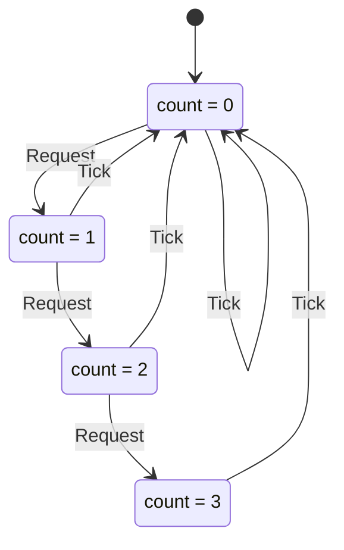

# Rate Limiter: Constants and Time

This guide builds a rate limiter: **at most `Limit` requests per time
window**. It assumes you've worked through
[Getting Started: Hello, World](getting-started.md), so project setup and
the basic workflow are only sketched here.

Compared to Hello, World, it adds three ideas:

1. **Constants.** The limit is a TLA+ `CONSTANT`, given a value in the
   `.cfg` file.
2. **Time as an external action.** Your code never "does" the passing of
   time; time just passes. The spec models it as an action, and the mapping
   drives it with a fake clock.
3. **Rejections as the main behaviour.** Most interesting steps are requests
   the limiter must refuse, and Outlaw checks every refusal.

## 1. Set up the project

```console
$ mix new rate_limiter
$ cd rate_limiter
```

Add Outlaw to `mix.exs` exactly as in Getting Started (the dependency, the
`elixirc_paths` for `test/outlaw`, and the `preferred_envs` in `cli/0`), then:

```console
$ mix deps.get
$ mix outlaw.install
$ mix outlaw.new Limiter
* creating specs/Limiter.tla
* creating specs/Limiter.cfg
* creating specs/AGENTS.md
* creating test/outlaw/limiter_spec.ex
* creating test/outlaw/limiter_conformance_test.exs
```

## 2. Write the spec

Replace `specs/Limiter.tla` with:

```tla
---------------------------- MODULE Limiter ----------------------------
\* Limiter: allow at most Limit requests per time window.
EXTENDS Naturals

CONSTANT Limit          \* requests allowed per window

VARIABLE count          \* requests accepted in the current window

TypeOK == count \in 0..Limit

Init == count = 0

\* A request is accepted only while the window has room left.
Request == /\ count < Limit
           /\ count' = count + 1

\* The window passes. Time is outside our code's control: this is an
\* external event, and it can happen at any moment.
Tick == count' = 0

Next == Request \/ Tick

Spec == Init /\ [][Next]_count
=============================================================================
```

What's new here:

- **`CONSTANT Limit`** declares a value the spec doesn't fix. The spec works
  for any limit; the model you check picks one.
- **Two actions.** `Request` has a guard (`count < Limit`) and an effect.
  `Tick` has no guard at all: a window can end at any moment, whatever the
  count is.
- **No `CHECK_DEADLOCK FALSE`** this time. `Tick` is always possible, so the
  system can never get stuck.

Replace `specs/Limiter.cfg` with:

```
\* A small model: 3 requests per window is enough to exercise the limit.
CONSTANT Limit = 3
INIT Init
NEXT Next
INVARIANT TypeOK
```

TLC explores every state of this model, so keep constants small. A limit of
3 exercises exactly the same logic as a limit of 1000, in four states
instead of a thousand.

```console
$ mix outlaw.check Limiter
Limiter: pass
  check: pass (4 distinct states)

Outlaw: all checks passed.
$ mix outlaw.lock
Locked 2 spec files in specs/.outlaw.lock:
  Limiter.cfg
  Limiter.tla
```

Here is the whole state space, from `mix outlaw.graph Limiter --format
mermaid`. Every state can `Tick` back to `count = 0`, and `Request` climbs
until the limit, where it stops:



## 3. Get it implemented

Hand the spec to your agent, as in Getting Started. Add one sentence so the
implementation stays testable:

> Implement `specs/Limiter.tla` as `RateLimiter.Limiter`. Read
> `specs/AGENTS.md` first. **Take the clock as an option** so tests can
> control time. Complete `test/outlaw/limiter_spec.ex`, then run
> `mix outlaw.verify --json` until it passes. Don't edit `specs/`.

**The implementation**, `lib/rate_limiter/limiter.ex`:

```elixir
defmodule RateLimiter.Limiter do
  @moduledoc "Allows at most `limit` requests per window of `window_ms` milliseconds."
  use Agent

  @doc """
  Starts a limiter.

  Options: `:limit` (requests per window), `:window_ms`, and `:clock`, a
  zero-arity function returning the current time in milliseconds (defaults
  to the system's monotonic clock).
  """
  def start_link(opts) do
    clock = Keyword.get(opts, :clock, fn -> System.monotonic_time(:millisecond) end)

    Agent.start_link(fn ->
      %{
        limit: Keyword.fetch!(opts, :limit),
        window_ms: Keyword.fetch!(opts, :window_ms),
        clock: clock,
        window_start: clock.(),
        count: 0
      }
    end)
  end

  @doc "Records a request if the current window has room. Returns `:ok` or `{:error, :rate_limited}`."
  def request(limiter) do
    Agent.get_and_update(limiter, fn state ->
      state = roll_window(state)

      if state.count < state.limit do
        {:ok, %{state | count: state.count + 1}}
      else
        {{:error, :rate_limited}, state}
      end
    end)
  end

  @doc "How many requests the current window has accepted."
  def count(limiter), do: Agent.get(limiter, &roll_window(&1).count)

  # Starts a new window once the current one has passed.
  defp roll_window(state) do
    now = state.clock.()

    if now - state.window_start >= state.window_ms,
      do: %{state | window_start: now, count: 0},
      else: state
  end
end
```

Notice that nothing in this code is called "tick". The implementation only
ever asks the clock what time it is. The spec's `Tick` is something that
happens *to* the code.

**The mapping module**, `test/outlaw/limiter_spec.ex`:

```elixir
defmodule RateLimiter.Specs.Limiter do
  use Outlaw.Conformance, spec: "specs/Limiter.tla"

  alias RateLimiter.Limiter

  # Must match `CONSTANT Limit = 3` in specs/Limiter.cfg.
  @limit 3
  @window_ms 1_000

  @impl true
  def init do
    # A fake clock we control: time only moves when the spec says Tick.
    {:ok, clock} = Agent.start_link(fn -> 0 end)
    now = fn -> Agent.get(clock, & &1) end

    {:ok, limiter} = Limiter.start_link(limit: @limit, window_ms: @window_ms, clock: now)
    {:ok, %{limiter: limiter, clock: clock}}
  end

  @impl true
  def actions do
    %{
      "Request" => StreamData.constant(%{}),
      "Tick" => StreamData.constant(%{})
    }
  end

  @impl true
  def action("Request", _params, ctx) do
    case Limiter.request(ctx.limiter) do
      :ok -> {:ok, ctx}
      {:error, reason} -> {:rejected, reason, ctx}
    end
  end

  # Time is an external event: the mapping makes a whole window pass.
  def action("Tick", _params, ctx) do
    Agent.update(ctx.clock, &(&1 + @window_ms))
    {:ok, ctx}
  end

  @impl true
  def project(ctx), do: %{"count" => Limiter.count(ctx.limiter)}
end
```

This is the **external-effect pattern**, and it works for anything outside
your code's control: time, a payment gateway going down, a network
partition.

1. Model the event as a spec action (`Tick`).
2. Give the implementation a seam for it (the `:clock` option).
3. In the mapping, make the action drive a fake behind that seam (advance
   the fake clock by one window).

Two smaller points:

- The mapping's `@limit` must match the `.cfg`. The comment says so,
  because nothing else ties them together.
- `project/1` calls `Limiter.count/1`, which rolls the window. Right after a
  `Tick` the count reads `0` even though no request has arrived yet,
  exactly as the spec says.

## 4. Verify

```console
$ mix outlaw.verify
lock: pass

Limiter: pass
  check: pass (4 distinct states)
  conformance: pass (100 runs, seed 157098)
    coverage: actions 2/2, observed states 4/4, transitions 7/7

Outlaw: all checks passed.
```

The coverage line shows the runs reached both actions and all four states.
They also took all seven transitions in the graph above, including the
`Tick` self-loop at `count = 0`. Outlaw steers its runs toward transitions
in the spec's graph, which is why the limit itself (`count = 3`, where
`Request` must be refused) gets reached rather than left to luck. If a
check ever misses part of the graph, the coverage line says so with a
`warning:`.

## 5. Break it, twice

**An off-by-one.** Change the check in `request/1` to
`if state.count <= state.limit do`:

```console
$ mix outlaw.verify
lock: pass

Limiter: FAIL
  check: pass (4 distinct states)
  conformance: fail
    error[action_not_enabled]: Request was accepted, but the spec doesn't allow it in count = 3
       ╭─[specs/Limiter.tla:14:15]
       │
    12 │
    13 │ \* A request is accepted only while the window has room left.
    14 │ Request == /\ count < Limit
       •               ──────┬──────
       •                     ╰── false here: count = 3
    15 │            /\ count' = count + 1
    16 │
       │
       ╰─────
         help: return {:rejected, reason, ctx}

    Conformance failure in Limiter: action_not_enabled (seed 480105)
    The implementation accepted an action the spec does not allow in this state. It should have returned {:rejected, reason, ctx}.

      step  action / params / outcome / implementation state
      0     (init)       ok          count = 0
      1     Request %{}  ok          count = 1
      2     Request %{}  ok          count = 2
      3     Request %{}  ok          count = 3
      4     Request %{}  ok          count = 4   <-- diverges here

    Spec allowed: (no Request transition is enabled here)
    minimized: 13 replays, 3 items removed, 0 params reduced

    Reproduce: mix outlaw.test Limiter --seed 480105
    Visualize: mix outlaw.graph Limiter --trace failure --open

Outlaw: verification FAILED.
```

The diagnostic points at the guard the fourth request violated, and the
step table is the shortest failing run: four requests in a row. The
`minimized:` line says Outlaw removed three steps from the run that first
failed (which also had some `Tick`s in it) to get there.

**A window that doesn't reset.** Put the check back, and instead forget to
reset the count when a new window starts:

```elixir
do: %{state | window_start: now},
```

```console
$ mix outlaw.verify
lock: pass

Limiter: FAIL
  check: pass (4 distinct states)
  conformance: fail
    error[illegal_transition]: Tick reached a state the spec doesn't allow
       ╭─[specs/Limiter.tla:19:1]
       │
    17 │ \* The window passes. Time is outside our code's control: this is an
    18 │ \* external event, and it can happen at any moment.
    19 │ Tick == count' = 0
       • ────────┬─────────
       •         ╰── implementation reached count = 1
    20 │
    21 │ Next == Request \/ Tick
       │
       ╰─────
         note: spec allowed: count = 0

    Conformance failure in Limiter: illegal_transition (seed 931417)
    The implementation's new state is not one the spec allows after this action.

      step  action / params / outcome / implementation state
      0     (init)       ok          count = 0
      1     Request %{}  ok          count = 1
      2     Tick %{}     ok          count = 1   <-- diverges here

    Spec allowed: count = 0
    minimized: 6 replays, 2 items removed, 0 params reduced

    Reproduce: mix outlaw.test Limiter --seed 931417
    Visualize: mix outlaw.graph Limiter --trace failure --open

Outlaw: verification FAILED.
```

This is a different kind of failure. The action was allowed, so nothing was
wrong with *when* it ran; the problem is where it landed. After a window
passes, the spec says `count' = 0`, but the implementation still reports
`count = 1`. Two steps reproduce it: one request, then a tick.

Restore the reset, and `mix outlaw.verify` passes again.

## What you've learned

- **Constants** keep the spec general and the checked model small.
- **External events** (time, failures, other systems) become spec actions.
  Your code gets a seam for them, and the mapping drives a fake through it.
- **Two failure shapes.** `action_not_enabled` means the code did something
  it shouldn't have done *at all* in that state. `illegal_transition` means
  the action was fine, but the resulting state is wrong.
